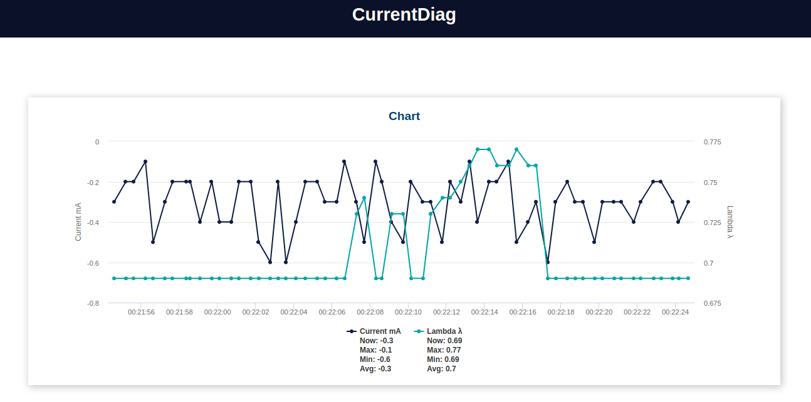
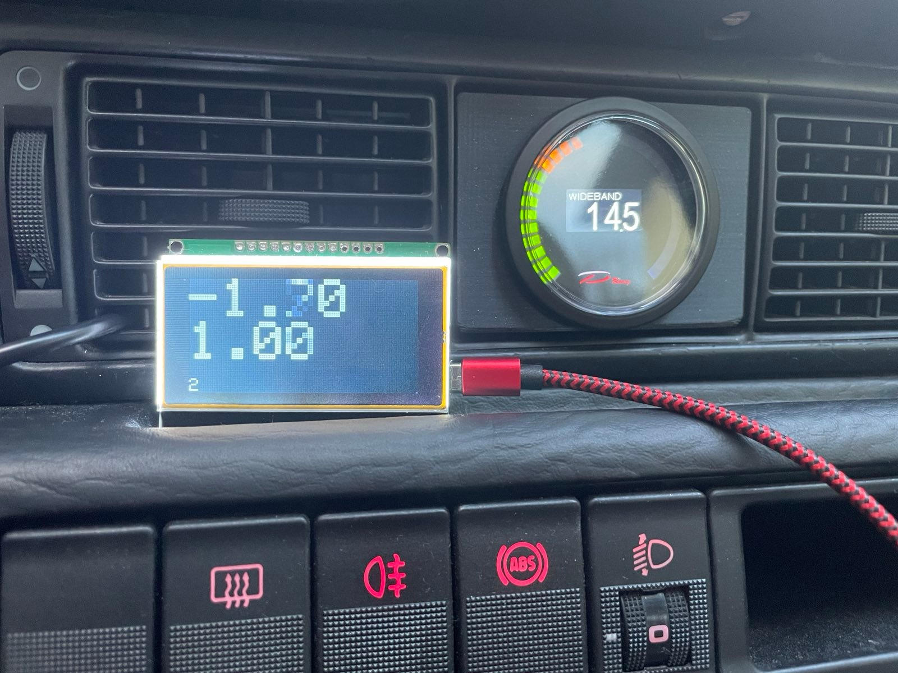
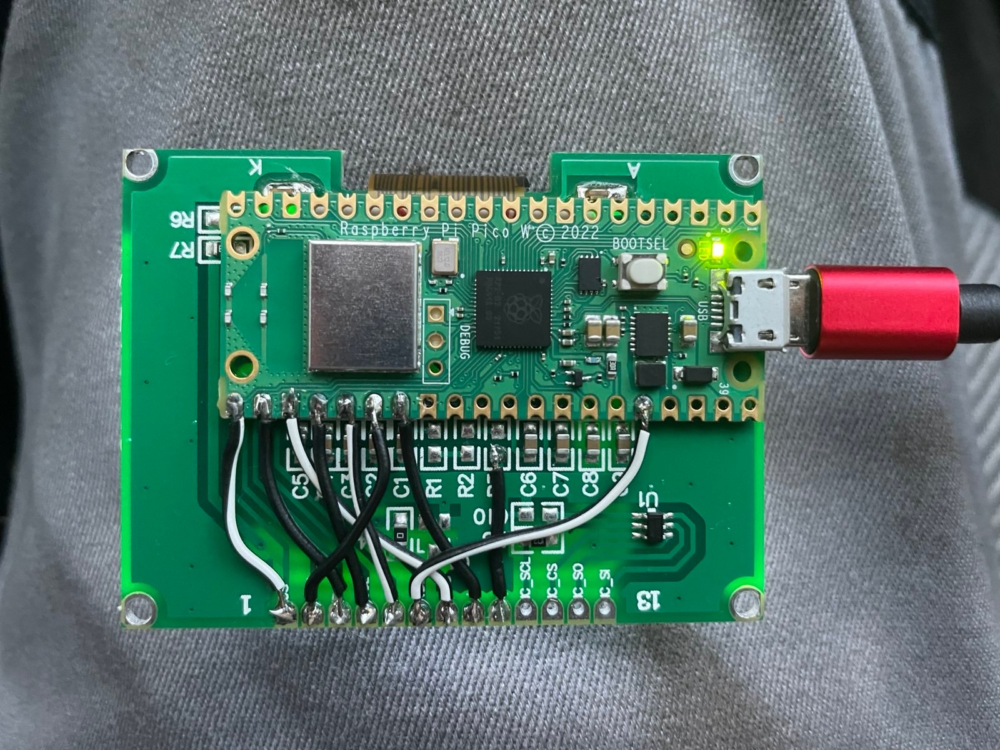

# ESP8266-CurrentDiag
ESP8266 (Wemos D1 mini) based Small Current Diagnostic Tool

Measure the current of the electro-hydraulic pressure regulator of a KE-Jetronic

Additionally the lambda value can be measured via the analog input if the gauge has a 5v output. For this, a 180k Ohm resistor must be connected in series before the A0.

I am using the *AFR Wideband Kit from DepoRacing with an OLED 52772WBOLED*

Lastly, I added a UDP connection, which transmits the values at a higher update rate, compared to the WebGui. For this I use a RaspberryPi Pico W with an Adafruit library for CircuitPython 8.0.3. The ESP8266 is the server and the Pico W is the client.

